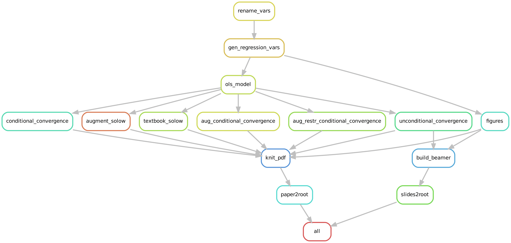

# Reproducible Research Workflows with Snakemake and R

[](https://travis-ci.org/lachlandeer/snakemake-econ-r)

* Contributors:
    - Lachlan Deer (@lachlandeer) [cre, aut]
    - Julian Langer (@julianlanger)[cre, aut]

## Introduction

We provide a template for a reproducible research project using `Snakemake` and the `R` programming language.
We use `Snakemake` to construct a set of *rules* that form a DAG that implements the entire research pipeline, starting with some data cleaning and finishing with compiling a pdf article and slides.
The `R` language is used to perform all steps of our analysis and to compile our pdf documents (the latter via the `knitr`, `bookdown` and `rticles` packages).

## Motivating Example

Our example project involves replicating the main tables and figures of Mankiw, Romer and Weil's classic 1992 QJE article "[A Contribution to the Empirics of Economic Growth.](https://eml.berkeley.edu/~dromer/papers/MRW_QJE1992.pdf)"
We hope by using an example that is simple in its methods readers focus on how we have chosen to assemble both pure R codes and the Snakemake rules that build our project, rather than getting lost on econometric methodologies.

## Installation Instructions

Follow these Steps to install the necessary software on your system

### Step 1: Installing Necessary Software
You need to have the following software and packages installed:

1. Python 3 (Python 3.6 or higher)
2. Snakemake (we'll install the correct version in a couple of lines time!)
3. R (Ideally R 3.6.1 or higher)

#### Installing Python

Either:

1. Install Anaconda Python:
    - We provide instructions on how to install anaconda python [here](https://pp4rs.github.io/2020-uzh-installation-guide/python/)
2. Install Python using the deadsnakes ppa:
    - Here's how to add the deadsnakes ppa and install Python 3.8
    ```bash
    $ sudo apt-get install software-properties-common
    $ sudo add-apt-repository ppa:deadsnakes/ppa
    $ sudo apt-get update
    $ sudo apt-get install python3.8
    ```

#### Installing Snakemake

We have included a `requirements.txt` file that we can use to install a specific version of snakemake.
This makes sure that our example runs on your machine (or at least won't break because you use a different version of snakemake than we do)

``` bash
pip3 install -r requirements.txt
```

you may need to replace `pip3` with `pip`

**Note:** In recent versions of Snakemake you must state how many cores you want to use when executing rules. 
In this example, we encourage the use of a single core, so when we use snakemake we will always write it as `snakemake --cores 1 <something>`.
More cores speeds things up, but our example is quite light so it seems unnecessary.

#### Installing `R`

We provide instructions on how to install R [here](https://pp4rs.github.io/2020-uzh-installation-guide/r)

### Step 2: Install the Required `R` libraries.

We utilize many additional R packages inside the scripts that build our project.
To ensure that our project runs on every machine without issues relating to R packages not being installed we utilize `renv` to control the list of packages needed to run this example, and to monitor the version of the package we use.

Once you have completed the installation instructions above, we have provided a simple command to install renv.
Open a terminal and navigate to this directory.
Then in the terminal enter the following command to install renv:

``` bash
snakemake --cores 1 renv_install
```

Then you will need to provide consent for `renv` to be able to write files to your system:

``` bash
snakemake --cores 1 renv_consent
```

Once this is complete you can use renv to create a separate R environment that contains the packages we use in our example by entering the following command into the terminal:

``` bash
snakemake --cores 1 renv_init
```

The above command will initialize a separate R environment for this project.

Now we will install the necessary packages (and their precise versions) which are stored in the `renv.lock` file:

``` bash
snakemake --cores 1 renv_restore
```

This will install all the packages we need. It may take a while.

## Running the Example

Once the installation instructions are complete, we can run the project.
The result will be 2 pdfs: (1) mrw_replication.pdf - a pdf with some figures and tables of results included; and
(2) mrw_replication slides - a beamer slide deck that also contains some figures and pdfs that were produced by the workflow.

To run the project, enter the following into the terminal:

``` bash
snakemake --cores 1 all
```

This will run through all the R scripts in order to complete the build of the project.

## Visualization of the Workflow

Snakemake workflows are a directed acyclic graph (DAG).
We can visualize the relationship between the rules (a simplified view of the DAG) in our workflow:



Check out the rules in `./rules/dag.smk` for various visualizations of the workflow. 
You will need to install `graphviz` to run these rules - we have included a rule inside `dag.smk` to install this for you. 

## Archiving `R` packages in a new project

* If you are starting a new project, which is likely if you are using
   this template, you need to initialize a new renv instance to
   track your `R` packages and store them.
   Enter the following command into the same terminal as above
   and press `Return`.

   ``` bash
   snakemake --cores 1 renv_init
   ```

* If we add new `R` packages that we want to include in a project, we take a `snapshot` of the packages utilized in the project with:

```bash
snakemake --cores 1 renv_snap
```

## Suggested Citation:

Deer, Lachlan and Julian Langer. 2020. Reproducible Economics Research Workflows with Snakemake.
